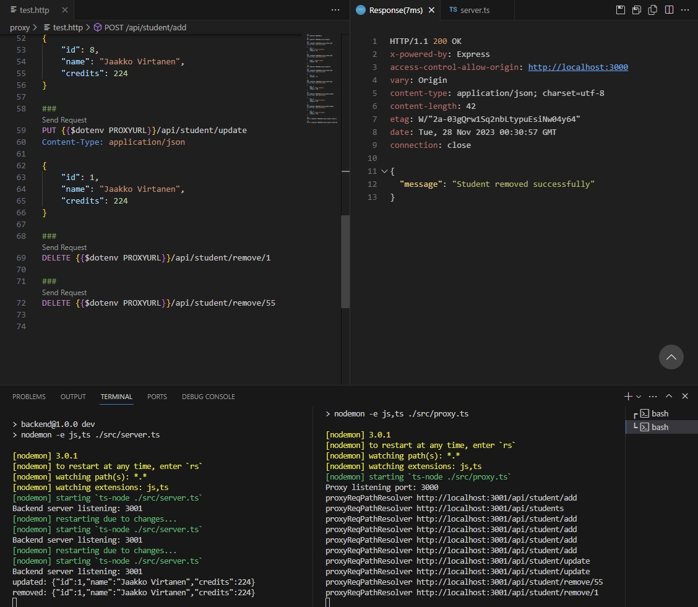

# Final Compulsory Task of Server Technologies
Author: Tommi Heino

## About
Implementation consists of 5 endpoints using protocols GET, POST, PUT, DELETE:    
'/' - Welcome message    
'/api/students' - GET all students    
'/api/student/:id' -  GET one student by ID   
'/api/student/add' - POST new student to DB  
'/api/student/update' - PUT update student   
'/api/student/remove/:id' - DELETE student by ID    

It uses sqlite-database (students.db) as a storage for students.

### GET
User can use GET method to retrieve info of all students in the database...  

     
... or just one by using ID.       

Error handling is also implemented, so if the user requests ID that isn't in the DB, error message appears:     
     

### POST
User can use POST method to add new students to the database

If information including ID, name or credits are missing, following error message appears:

Also if student already exists with the same ID:

### PUT
Previously added information can be updated using PUT method. Any parameters can be updated if needed

Also error handling exists, if the student with specified ID is missing:

### DELETE
This wasn't TO-DO-methdod in the task, but I wanted to implement it too for practising reasons. Student can be removed using ID.

And if student with specified ID doesn't exist:

